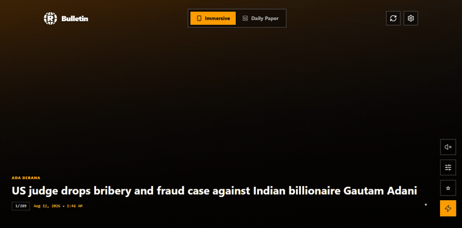

# Bulletin — News, reimagined

An always-listening news app for a generation that scrolls and listens instead of
reading headline grids. Pick your sources and topics, and the app becomes your
personal daily paper — read it, scroll it, or have it narrated to you.



## What's inside
- **TikTok-style vertical news scroll** (`BulletinFeedScroll`) — one story per screen, snap scroll.
- **Multi-image auto-switching** (`AutoImageReel`) — when an article has several images, they crossfade automatically (Dhivehi-friendly, respects `prefers-reduced-motion`).
- **Listen (TTS)** — switchable in Settings:
  - **Browser WebSpeech** (default) — free built-in system voices. Zero download, zero API key, works on every device.
  - **AWS Polly** — studio-quality neural voices (Matthew, Joanna, Amy, Stephen…) via the official Polly API. Free tier: 1M neural characters/month. Needs AWS credentials (see "AWS Polly setup" below).
  - **Keyless Dhivehi (dhivehi.mv)** — Common Voice-based Dhivehi TTS via a Worker proxy. No API key, no download. Used automatically when Dhivehi news is enabled.
- **Daily Brief / Daily Paper** — on-device brief generator (`generateNewsBrief`) groups today's stories by source into a personalized newspaper. An optional Groq pass (`GROQ_API_KEY`) polishes the writing when a key is set; otherwise it falls back to the on-device generator. Fully configurable in Settings (topics, sources, size, AI toggle).
- **Multilingual** — `en` + `dv` (Dhivehi) UI strings; independent TTS narration language; full RTL layout for Thaana (`textDirection`).
- **Easy setup** — pick interests → sources auto-onboard. No RSS pasting.

## Run it locally (dev server)
```bash
npm install
npm run dev      # http://localhost:3000  (Express + Vite middleware)
```

## Deploy to Cloudflare Workers
This project is a Cloudflare Workers SPA: the static build is served by the
**Static Assets** binding, and `/api/*` requests are handled by the Worker
(`src/worker.ts`). WebSpeech runs entirely in the browser, so it needs
no Worker-side code. AWS Polly runs server-side in the Worker (needs creds).
The Dhivehi TTS engine proxies dhivehi.mv from the Worker (keyless, no creds).

```bash
npm install
npm run build            # builds the SPA into ./dist
npx wrangler login       # one-time browser auth (or set CLOUDFLARE_API_TOKEN)
npm run deploy           # npm run build && wrangler deploy
```

Preview locally with `npm run cf:dev` (serves `dist/` + Worker routes via
`wrangler dev`).

### `wrangler.jsonc` highlights
- `main`: `src/worker.ts`
- `assets.directory`: `./dist`, `not_found_handling: "single-page-application"`
- `compatibility_flags`: `["nodejs_compat"]` (for `crypto.subtle` / WebSocket / AWS SDK)

## AWS Polly setup (for the cloud TTS engine)

Polly needs AWS credentials. They stay server-side — never shipped to the browser.

### 1. Create an AWS account
- Go to https://aws.amazon.com → **Create an AWS Account** (free tier eligible).
- You'll need a phone number + card for identity verification (no charges on free tier).

### 2. Create an IAM user with Polly access (console walkthrough)
1. Sign in to the **AWS Console** → open **IAM** (search "IAM").
2. Left menu → **Users** → **Create user**.
3. Name it e.g. `bulletin-polly`. Leave "Provide user access to the AWS Management Console" **unchecked**. Click **Next**.
4. **Set permissions** → choose **Attach policies directly**.
5. Search and tick **`AmazonPollyReadOnlyAccess`**. (Read-only is enough — Polly synthesis is a read action.) Click **Next** → **Create user**.
   - Free-tier tip: `AmazonPollyReadOnlyAccess` is sufficient and safest. Don't grant `AdministratorAccess`.
6. Open the new user → **Security credentials** tab → **Create access key**.
7. Choose **"Third-party service"** (or "Command Line Interface") → **Next** → **Create key**.
8. **Copy the Access key** and **Secret access key** now — the secret is shown only once.

### 3. Give the key to the app
**Local dev** — create a `.env` file in the project root:
```bash
AWS_ACCESS_KEY_ID=AKIA...your-access-key
AWS_SECRET_ACCESS_KEY=your-secret-key
AWS_REGION=us-east-1      # pick the region closest to you
```
Then `npm run dev`. The `/api/tts/polly` route reads these automatically.

**Cloudflare Worker (prod)** — set them as secrets so they're never in the repo:
```bash
npx wrangler secret put AWS_ACCESS_KEY_ID
npx wrangler secret put AWS_SECRET_ACCESS_KEY
npx wrangler secret put AWS_REGION
```
(Or add them to `.dev.vars` for local `wrangler dev`.)

### 4. Pick a voice
In the app → **Settings → TTS Engine → AWS Polly (Cloud)** → choose a voice
(Matthew/Joanna/Amy/Stephen/Danielle/Kajal). Tap the play button to preview.
The free tier covers ~1 million neural characters/month (~10–15 hours of audio).

### Cost
- Neural voices: **first 1M chars/month free**, then ~$16 / 1M chars.
- Standard voices: **first 5M chars/month free**.
- A daily 3-minute brief is a few thousand chars — comfortably within free tier.

> **Edge TTS removed:** the old reverse-engineered Edge TTS WebSocket was killed by
> Microsoft (returns 401/403 as of 2026-08), so it was replaced by AWS Polly for the
> cloud-quality path and browser WebSpeech for the zero-config free path.

## Firebase TTS cache (shared, cross-device, cuts Polly cost)

Once a news sentence is synthesized with Polly, the MP3 is stored in **Firebase
Firestore** keyed by a hash of (text + voice + engine + rate). The next user — on
*any* device — gets the cached MP3 instead of re-synthesizing, so repeat plays are
instant and AWS Polly is only ever billed once per unique sentence.

### 1. Create a Firebase project (free Spark plan)
- https://console.firebase.google.com → **Add project** (free Spark = the free tier).
- **Build → Firestore Database → Create database** → start in **test mode** (we lock
  it down with rules next), region = nearest.

### 2. Add a Web App and grab the API key + Project ID
- **Project settings → Your apps → Web app** → register.
- Copy the **Web API Key** and the **Project ID** (top of Project settings).

### 3. Security Rules (lock to the cache collection only)
In **Firestore → Rules**, paste:
```
rules_version = '2';
service cloud.firestore {
  match /databases/{db}/documents {
    match /pollyCache/{hash} { allow read, write: if true; }
    match /pollyCacheMeta/{any} { allow read, write: if true; }
  }
}
```
The cache holds only public news audio (no user data), so open read/write scoped to
these two paths is safe.

### 4. Give the keys to the app
**Local dev** — copy `.dev.vars.example` to `.dev.vars` and fill it in (it's gitignored).
Then `npm run dev`. The cache auto-enables when both values are present.

**Cloudflare Worker (prod)** — set them as secrets (never in the repo):
```bash
npx wrangler secret put FIREBASE_API_KEY
npx wrangler secret put FIREBASE_PROJECT_ID
```

### 5. Weekly self-reset (stays inside the free tier)
A meta doc tracks the doc count. Every **7 days**, if the cache exceeds
`POLLY_CACHE_MAX_DOCS` (default **50,000 ≈ 500 MB**, well under the 1 GB free limit),
the app deletes the **oldest `2000` docs** (oldest news first). The sweep is lazy —
it runs inside the `/api/tts/polly` route, so there is **no Cloud Function or
scheduler to set up**. Each sweep only reads + deletes 2000 docs, comfortably within
the 50k reads/day free allowance; any backlog converges over subsequent weeks.
- Optional native safety net: add a **7-day TTL** on the `createdAt` field (Firestore
  → Build → Firestore → the collection → **Automate** → TTL). TTL deletes are **free**
  and don't count against your write quota.
- Tune the cap: `POLLY_CACHE_MAX_DOCS=40000 npx wrangler secret put POLLY_CACHE_MAX_DOCS`.

The `/api/health` endpoint reports `"pollyCache": true/false` so you can confirm it's live.

## Notes
- Standalone mode fetches RSS via a public RSS→JSON proxy in `feedClient.ts`, with
  a server-side `/api/feed-proxy` fallback for CORS/Cloudflare-blocked feeds.
- Dhivehi TTS voice may be absent on some devices; the app detects this and shows an install hint.
